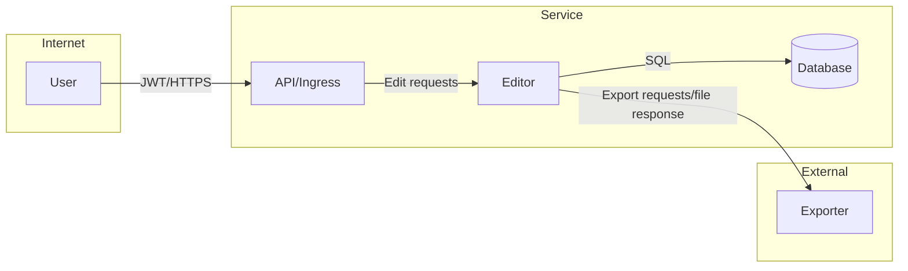

# TM - Требования безопасности + Модель угроз + ADR

> Этот файл - **индивидуальный**. Его проверяют по **rubric_TM.md** (5 критериев × {0/1/2} → 0-10).
> Подсказки помечены `TODO:` - удалите после заполнения.
> Все доказательства/скрины кладите в **EVIDENCE/** и ссылайтесь на конкретные файлы/якоря.

---

## 0) Мета

- **Проект (опционально BYO):** «учебный шаблон»
- **Версия (commit/date):** TODO: abc123 / 2025-10-12
- **Кратко (1-2 предложения):** Онлайн-редактор листов персонажа для ролевых игр. Он позволяет хранить заполненные листы в облаке, экспортировать их в формате PDF и открывать доступ к ним другим людям.

---

## 1) Архитектура и границы доверия (TM1, S04)

- **Роли/активы:** Роли: пользователь(у пользователя есть доступ только к своим документам), админ(у админа есть доступ к всем хранящимся на сайте документам); Активы: заполненные пользователями листы персонажей
- **Зоны доверия:** Internet / Service / Export-service / Storage
- **Context/DFD:**



- **Критичные интерфейсы и допущения:**  
  Данные, передаваемые между API gateway и сервисом редактирования, а так же из сервиса редактирования в базу данных считаются доверенными, поскольку API gateway работает с ограниченным количеством endpoint-ов, у каждого из которых есть строго определенное поведение, и запросы между этими сервисами могут проходить верификацию, так как все эти сервисы являются внутренними. Остальные данные доверенными не являются - экспорт PDF будет проходить с использованием внешнего сервиса, ответ которого нельзя считать доверенным, и пользовательские данные доверенными не могут быть никогда.; Роль администратора обеспечивается проверкой роли пользователя, пытающегося получить доступ к чьим-либо данным, через базу данных. Если в базе данных отмечено, что пользователь является администратором, ему предоставляется доступ к любой части сервиса, иначе доступ предоставляется только к документам, где он является автором. ; Граница доверия между интернетом и сервисом проходит по API gateway, граница доверия между сервисом и внешним сервисом экспорта PDF проходит по запросу между редактором и экспортером.

---

## 2) Реестр угроз STRIDE (TM2, TM3, S04)

_Минимум: закрыть все буквы **S, T, R, I, D, E**. Оценки **L/I** по шкале 1-5._

| ID  | STRIDE | Компонент/поток | Угроза (кратко)                                   | L | I | L×I |
|-----|--------|------------------|----------------------------------------------------|---|---|-----|
| T01 | **S**  | GW             | Подмена личности украденным/поддельным токеном     | 3 | 5 | 15  |
| T02 | **T**  | Editor, DB      | XSS-атака посредством записи в базу данных информации, интерпретируемой как вредоносный скрипт при отображении в браузере | 2 | 5 | 10   |
| T03 | **R**  | DB | Отсутствие информации о том, какой администратор совершил действие         | 1 | 1 | 1   |
| T04 | **I**  | Editor → DB          | SQL-инъекция через записанные в пользовательский документ данные | 2 | 5 | 10  |
| T05 | **D**  | Exporter         | DoS отсутствием или задержкой ответа при экспорте PDF | 4 | 5 | 20  |
| T06 | **E**  | DB     | Неавторизованная запись в базу данных информации о привилегиях администратора у злоумышленника  | 1 | 4 | 4  |


---

## 3) Приоритизация и Top-5 _(TM3, S04)_

1) **T05 DoS** - L×I=20; отсутствие таймаутов и лимитов на использование внешнего сервиса 
2) **T01 Подмена личности** - L×I=15; доступ к пользовательским данным 
3) **T04 Инъекции** - L×I=10; риск компрометации БД, пользовательских данных и прав администратора.  
4) **T02 Tampering** - L×I=10; риск исполнения произвольного кода в браузерах пользователей.  
5) **T06 Повышение привилегий** - L×I=4; требуется трассируемость назначения и снятия администраторов.  

---

## 4) Требования (S03) и ADR-решения (S05) под Top-5 (TM4)

### NFR-1. Аутентификация и защита токенов

- **AC (GWT):**
  - **Given** валидный токен, **When** запрос `/api/...`, **Then** `200` и `X-User-Id=subject`.
  - **Given** просроченный/поддельный токен, **When** запрос, **Then** `401` и событие `auth.token_invalid` в аудите.

### NFR-2. Timeouts / Retry / Circuit Breaker

**Кейс:** внешние вызовы не «висят» бесконечно.

**Requirement:** Исходящие вызовы к Exporter: timeout ≤ **2s**, retry ≤ **3** с джиттером; circuit-breaker при ошибках **≥50%** за **1 мин**.
**Acceptance (G-W-T):**

```Gherkin
Given недоступность Exporter
When сервис вызывает Exporter при обращении к /api/export/<sheetId>
Then суммарное ожидание ≤ 6s; выполняются не более 3 retry с джиттером; после порога ошибок включается circuit breaker
```

### NFR-3. Аудит критических операций

- **AC (GWT):** логируется `correlation_id`, uid, время и результат для операций (`login`, `role_change`, `data_export`, …).


### NFR-4 Authorization / RBAC / Tenant Isolation (`Security-AuthZ/RBAC`)

**Кейс:** доступ строго по ролям и арендаторам.

**Requirement:** Пользователь `<tenant=A>` не может читать/менять ресурсы `<tenant=B>`; роль `<role>` ограничивает действия.
**Acceptance (G-W-T):**

```Gherkin
Given пользователь с ролью User из tenant A
When он запрашивает ресурс tenant B
Then ответ 404 (или 403 по политике) без утечки данных
```

### NFR-5 Security - Input Validation (`Security-InputValidation`)

**Кейс:** размер/тип/схема запросов.

**Requirement:** Для запроса Editor -> DB(endpoint RecordSheet): размер тела ≤ **0.5 MiB**, только разрешенные символы.
**Acceptance (G-W-T):**

```Gherkin
Given тело 2× больше 0.5 MiB
When POST Editor -> RecordSheet
Then 413 и тело ошибки в RFC 7807; запрещенные символы приводят к 400
```

---

### Краткие ADR (минимум 2) - архитектурные решения S05

(карточки короткие, по делу)


#### ADR-001 - Timeouts + Jitter + Circuit Breaker

- **Context:** T05, NFR-2; внешний сервис не должен блокировать работу сервиса отсутствием ответа
- **Decision:** Timeout запроса экспорта PDF в 2 секунды; не более 3 повторов запроса
- **Trade-offs:** возможное влияние на UX при экспорте сложных PDF
- **DoD:** при отсутствии ответа Exporter в течение 2 секунд повторный запрос; при отсутствии ответов на 3 таких запроса - 500.

#### ADR-002 - Аудит критических действий

- **Context:** T03, NFR-3
- **Decision:** Хранение в базе данных истории действий администраторов с указанием совершавших их администраторов.
- **Trade-offs:** увеличение объема базы данных
- **DoD:** при назначении нового администратора, удалении, создании или обновлении документа в базе данных появляется запись об этом действии.
---

## 5) Трассировка Threat → NFR → ADR → (План)Проверки (TM5)

| Threat | NFR   | ADR     | Чем проверяем (план/факт)                                                                 |
|-------:|-------|---------|-------------------------------------------------------------------------------------------|
| T05    | NFR-2 | ADR-001 | Тест запроса в не дающий ответа Exporter; через 6 секунд сервис должен получить ответ 500 |
| T03 | NFR-3 | ADR-002 | Тесты на наличие записей в базе после создания документа, сохранения изменений в нем, его удаления, назначении и снятии администратора |

---

## 6) План проверок (мост в DV/DS)

- **SAST/Secrets/SCA:** TODO: инструменты и куда положите отчёты в `EVIDENCE/`
- **SBOM:** TODO: генератор/формат
- **DAST (если применимо):** TODO: стенд/URL; профиль
- **Примечание:** на этапе TM допустимы черновые планы/ссылки; финальные отчёты появятся в **DV/DS**.

---

## 7) Самопроверка по рубрике TM (0/1/2)

- **TM1. Архитектура и границы доверия:** [ ] 0 [ ] 1 [x] 2  
- **TM2. Покрытие STRIDE и уместность угроз:** [ ] 0 [x] 1 [ ] 2  
- **TM3. Приоритизация и Top-5:** [ ] 0 [x] 1 [ ] 2  
- **TM4. NFR + ADR под Top-5:** [ ] 0 [ ] 1 [x] 2  
- **TM5. Трассировка → (план)проверок:** [ ] 0 [x] 1 [ ] 2  

**Итог TM (сумма):** 7/10
